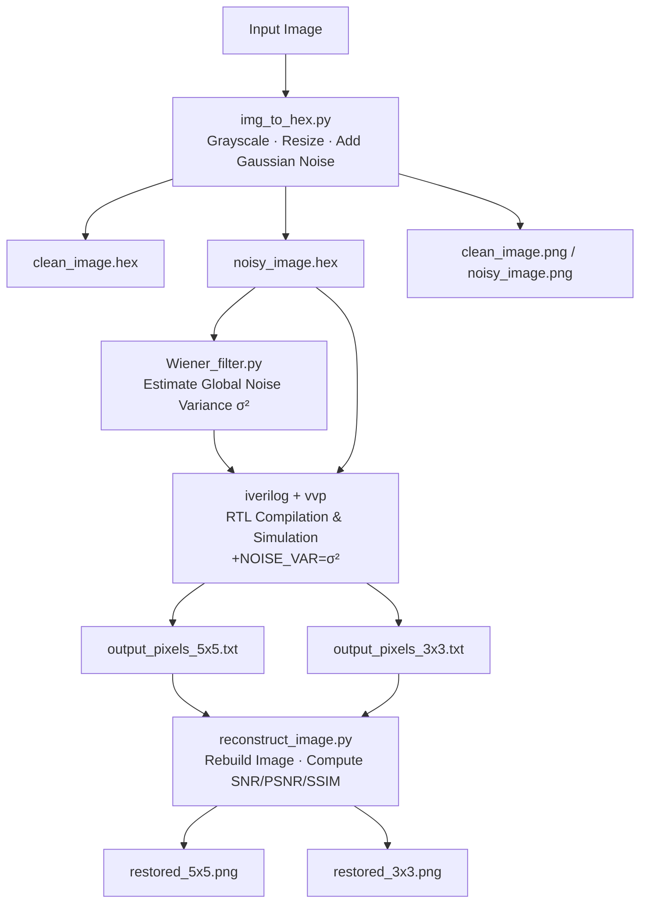
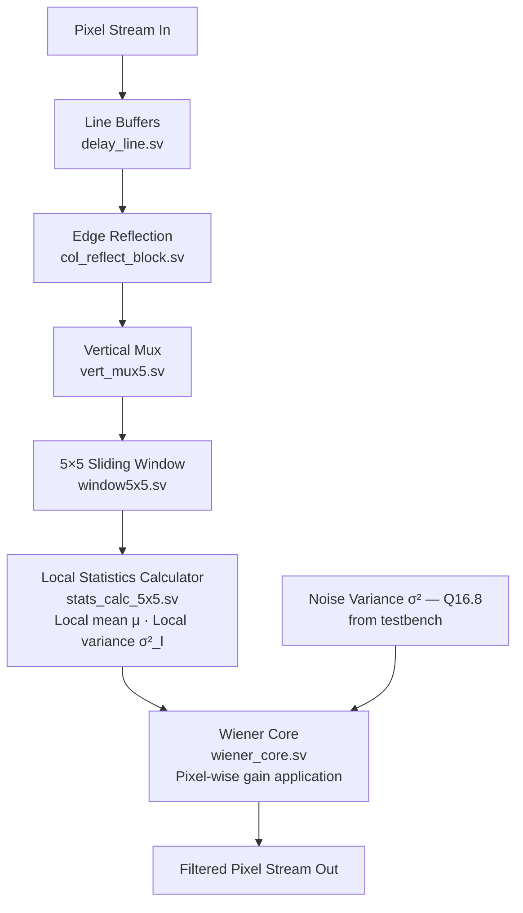

# Wiener Image Denoising Hardware Accelerator

> **Streaming RTL accelerator for Wiener image denoising, with a full Python evaluation pipeline.**  
> Built in SystemVerilog · Simulated with Icarus Verilog · Evaluated with scikit-image

---

## What This Is

A hardware accelerator that filters noisy images using the **Wiener filter** — an optimal linear estimator under Gaussian noise. The system is fully pipelined and streaming, designed for real FPGA deployment.

The project includes:
- A complete RTL design in SystemVerilog (5×5 and 3×3 kernel modes)
- A Python pipeline for preprocessing, noise injection, and quality evaluation
- Fixed-point arithmetic with Q16.8 noise variance encoding
- Edge-accurate output via symmetric reflection padding

---

## Results

| Metric | Noisy Input | Restored (5×5) |
|--------|-------------|----------------|
| SNR    | 14.13 dB    | 24.72 dB       |
| PSNR   | —           | 28.10 dB       |
| SSIM   | —           | 0.91           |

---

## Full Pipeline



---

## Hardware Architecture



> The design is **fully streaming** — no frame buffering required at the filter stage. One pixel in, one pixel out after pipeline fill.

---

## Repository Structure

```
frontEnd/
├── run.py                    # Single command to run the entire pipeline
│
├── img_to_hex.py             # Preprocessing: grayscale, resize, noise injection
├── Wiener_filter.py          # Noise variance estimation (Immerkær method)
├── reconstruct_image.py      # Pixel stream → image + SNR/PSNR/SSIM
├── reconstruct_image_rgb.py  # RGB reconstruction variant
│
├── rtl.f                     # RTL file list for iverilog
│
├── tb_wiener_top.sv          # Testbench: streams pixels, captures output
├── wiener_top.sv             # Top-level RTL module
├── wiener_core.sv            # Wiener gain computation
├── stats_calc_5x5.sv         # Local mean and variance over 5×5 window
├── window5x5.sv              # Sliding window generator
├── vert_mux5.sv              # Row selection multiplexer
├── col_reflect_block.sv      # Symmetric boundary extension
└── delay_line.sv             # Shift-register line buffers
```

---

## Quick Start

**1. Install Python dependencies**

```bash
pip install numpy pillow opencv-python scikit-image
```

**2. Install Icarus Verilog**

```bash
# Ubuntu/Debian
sudo apt install iverilog

# macOS
brew install icarus-verilog

# Verify
iverilog -V
```

**3. Run the full pipeline**

```bash
python run.py --img ../../images/test1.jpg --size 512 --snr 14
```

This single command handles everything: preprocessing → RTL compile → simulation → reconstruction → metrics.

---

## Step-by-Step (Manual)

**Step 1 — Preprocess image**
```bash
python img_to_hex.py input.jpg --size 512 --snr 20
# Outputs: clean_image.hex, noisy_image.hex, clean_image.png, noisy_image.png
```

**Step 2 — Estimate noise variance**
```bash
python Wiener_filter.py
# Example output: Estimated noise variance = 873.73
```

**Step 3 — Compile RTL**
```bash
iverilog -g 2012 -o sim.out -f rtl.f
```

**Step 4 — Run simulation**
```bash
vvp sim.out +NOISE_VAR=873.7
# Outputs: output_pixels_5x5.txt, output_pixels_3x3.txt
```

**Step 5 — Reconstruct and evaluate**
```bash
python reconstruct_image.py --file output_pixels_5x5.txt --out_img restored_5x5.png --size 512
python reconstruct_image.py --file output_pixels_3x3.txt --out_img restored_3x3.png --size 512
```

---

## Fixed-Point Arithmetic

Noise variance is passed to hardware in **Q16.8 fixed-point format**:

```
noise_var_q16_8 = round(σ² × 256)
```

This gives 8 bits of fractional precision with a representable range of 0 to 65535.996.

---

## Quality Metrics

```
SNR  = 10 · log₁₀( Σ f² / Σ (f − f̂)² )

PSNR = 10 · log₁₀( 255² / MSE )

SSIM = skimage.metrics.structural_similarity(f, f̂)
```

---

## Configuration

The RTL is parameterized for `512 × 512` images by default.  
To change image size, update these parameters in `tb_wiener_top.sv`:

```systemverilog
parameter IMG_W = 512;
parameter IMG_H = 512;
```

---

## Roadmap

- [ ] Dynamic image size via top-level parameters (no testbench edit required)
- [ ] FPGA synthesis flow (Vivado / Quartus)
- [ ] Throughput and resource utilization benchmarks
- [ ] RGB / multi-channel support
- [ ] Automated regression test suite

---

## Author

**Alen Faer, Tomer Beck**  
Electrical & Computer Engineering  
Technion – Israel Institute of Technology

*Project: Hardware Acceleration for Wiener Image Denoising*
